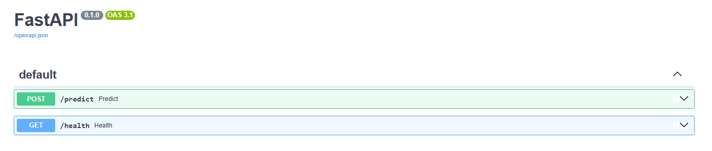
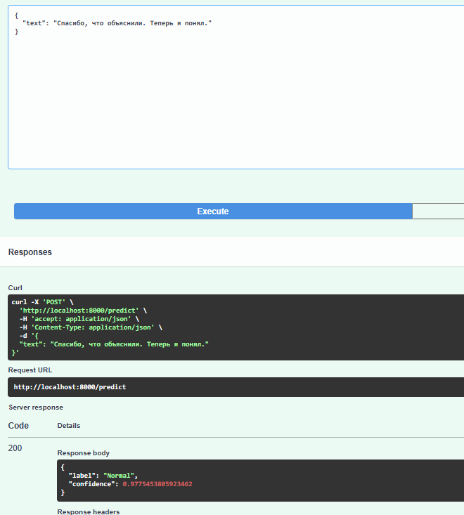
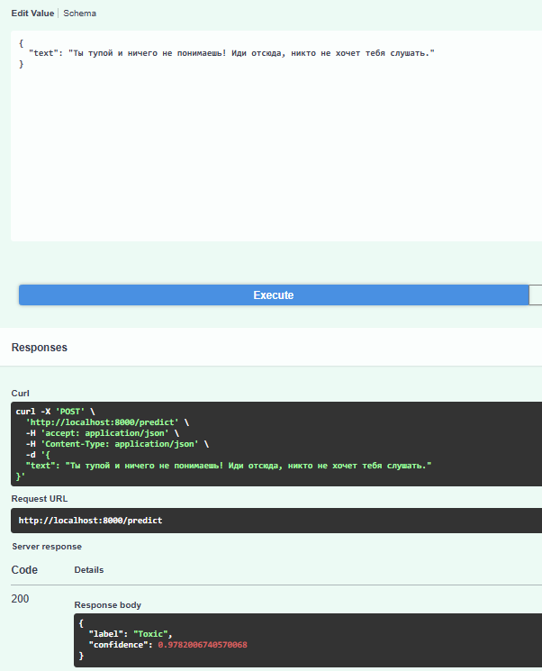

# Toxicity_Detector- классификация токсичных комментариев (RU)

Пайплайн бинарной классификации токсичности русскоязычных комментариев: от EDA и очистки данных до сравнения классических ML-моделей и BERT, с деплоем лучшей модели в виде REST API на FastAPI + Docker.

## Задача
Определить, является ли комментарий токсичным. Бинарная классификация (нормальный - 0, токсичный - 1) на несбалансированных данных

## Датасет

Russian Language Toxic Comments - 14412 уникальных комментариев, из которых ~33% токсичные

## Пайплайн
1. EDA и очистка
Проверка на дубликаты и пропуски
Анализ распределения длины текста по классам
Word cloud для нормальных и токсичных комментариев
2. Предобработка (для классических моделей)
Приведение к нижнему регистру, удаление небуквенных символов
Лемматизация через pymorphy3
Удаление стоп-слов (nltk)

Для BERT-моделей использовался сырой текст без очистки, лемматизация и удаление стоп-слов для него не нужны и могут терять полезные данные (пунктуация, регистр, порядок слов).

## Эксперементы

- Сравнила пять подходов:
  - Классические модели обучены на TF-IDF (1-2 grams) с подбором гиперпараметров через GridSearch/RandomizedSearch и 5-fold кросс-валидацией. 
  - BERT-модели дообучались с кастомным PyTorch training loop (mixed precision training, early stopping по F1 на валидации).
  - 
  
| Модель                 | F1 (Toxic) | F1 (Macro) | Precision | Recall | Accuracy | Время        |
| ---------------------- | ---------- | ---------- | --------- | ------ | -------- | ------------ |
| **LogisticRegression** | 0.82       | 0.86       | 0.82      | 0.81   | 0.88     | **0.07 сек** |
| **XGBoost**            | 0.74       | 0.80       | 0.72      | 0.76   | 0.82     | 0.13 сек     |
| **rubert-base-cased**  | 0.87       | 0.90       | 0.85      | 0.90   | 0.91     | ~12 мин      |
| **ruBert-base**        | 0.86       | 0.90       | 0.83      | 0.91   | 0.91     | ~12 мин      |
| **rubert-tiny2**       | **0.89**   | **0.92**   | **0.89**  | 0.89   | **0.93** | **~2.5 мин** |

## Вывод: 
Лёгкая rubert-tiny2 не уступает более тяжёлым BERT-моделям и показывает лучший результат по всем метрикам, при этом обучается быстрее. Причиной может быть небольшой объём данных: тяжёлые модели склонны к переобучению на маленьких выборках, а легковесные обучаются стабильнее и лучше обобщаются.

## Анализ ошибок

Разбор ложных срабатываний обеих топ-моделей показал:

- Модели не ловят токсичность, выраженную через сарказм, пассивно-агрессивная речь без оскорблений ("Ты не упустил. Молодец." - токсично, но без явных слов)
- Сигнал теряется на длиных текстах — при max_length=256 маркеры токсичности в длинных комментариях могут обрезаться или теряться на фоне большого объёма нейтрального текста.
- Возможный шум в разметке — часть текстов, размеченных как токсичные, по содержанию выглядят нейтральными (упоминание национальности/религии без явно негативного контекста)

## Деплой

Лучшая модель (rubert-tiny2) обёрнута в REST API на FastAPI и упакована в Docker-образ.

Структура проекта
```
project/
├── api.py                 # FastAPI-приложение (эндпоинты /predict, /health)
├── config.py               # переменные окружения, пути
├── train.py                 # класс InferenceService (загрузка модели, инференс)
├── model_weights.pt         # веса дообученной rubert-tiny2
├── requirements.txt
├── Dockerfile
├── .env                     # переменные окружения 
└── notebooks/
    └── Toxicity_Detector.ipynb       # весь пайплайн: EDA
```
Запуск
Через Docker
```bash
docker build -t toxicity-api .
docker run --env-file .env -p 8000:8000 toxicity-api
Локально
bash
pip install -r requirements.txt
uvicorn api:app --reload --port 8000
```
Сервис будет доступен на http://localhost:8000. Интерактивная документация — http://localhost:8000/docs.

## Пример запроса


## Технологии
- Python
- pandas
- scikit-learn
- XGBoost 
- PyTorch
- HuggingFace 
- Transformers
- pymorphy3
- FastAPI
- Docker
 
